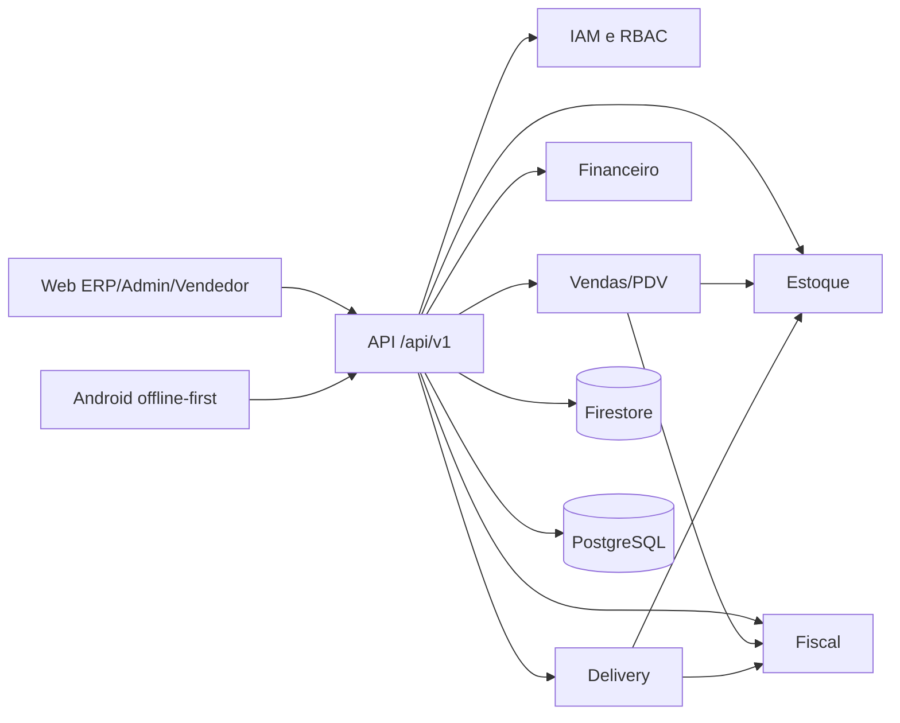

# Arquitetura

A arquitetura aprovada está detalhada em [architecture/README.md](architecture/README.md), acompanhada dos oito ADRs numerados em `docs/architecture/adr`.

O Synapse é um monólito modular NestJS com clientes React e Android. Firebase Auth identifica o usuário; a API resolve tenant, filial, depósito e permissões. Firestore atende o estado operacional e PostgreSQL os registros fiscal/financeiro. Providers isolam Gyn Fiscal, Sicredi e Itaú. Operações externas usam idempotência, fila e estados explícitos.

Alterações de fronteira, persistência, tenant, versionamento, eventos, offline, providers ou consistência de estoque exigem atualização do ADR correspondente.
