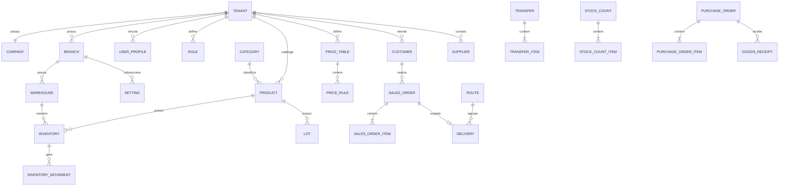
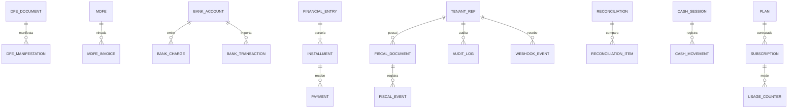
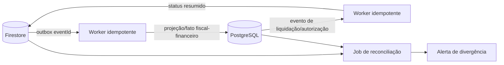

# Synapse — Modelagem de dados

Status: **Proposta — aguardando revisão humana**  
Fase: 0  
Última atualização: 2026-09-05  
Decisão-base: [ADR-0002 — Persistência poliglota](architecture/adr/0002-persistencia-poliglota.md)

## 1. Objetivo

Definir entidades, relacionamentos, tipos, validações, índices, paginação e denormalizações do ERP antes da implementação. O modelo suporta 100 mil ou mais produtos, 500 mil ou mais clientes e milhões de movimentos e vendas.

Firestore é a fonte de verdade do núcleo operacional e offline. PostgreSQL é a fonte de verdade fiscal, financeira, bancária e de auditoria. Integração entre os dois ocorre por outbox idempotente; não existe escrita dupla síncrona.

## 2. Convenções

### 2.1 Tipos canônicos

| Tipo lógico  | Firestore            | PostgreSQL      | Regra                                                          |
| ------------ | -------------------- | --------------- | -------------------------------------------------------------- |
| `Id`         | string UUID v7/ULID  | `uuid`          | gerado no servidor; IDs offline usam UUID v7 e são preservados |
| `TenantId`   | string               | `uuid`          | derivado da sessão; nunca aceito como autoridade do cliente    |
| `Instant`    | Timestamp            | `timestamptz`   | UTC; relógio do servidor                                       |
| `LocalDate`  | `YYYY-MM-DD`         | `date`          | datas fiscais, vencimentos e validade                          |
| `Money`      | int64 em centavos    | `numeric(18,2)` | BRL no MVP; nunca `float`                                      |
| `Qty`        | int64 em milésimos   | `numeric(18,3)` | unidade armazenada com escala 1/1000                           |
| `Rate`       | int32 em pontos-base | `numeric(9,6)`  | percentuais sem ponto flutuante                                |
| `Version`    | int >= 1             | `bigint`        | concorrência otimista; incrementa a cada mutação               |
| `Status`     | enum string          | enum/check      | transição validada pelo domínio                                |
| CPF/CNPJ/EAN | string normalizada   | `varchar`       | somente dígitos; preservar zeros iniciais                      |

Todo registro mutável contém `id`, `tenantId`, `createdAt`, `createdBy`, `updatedAt`, `updatedBy` e `version`. Exclusão lógica usa `deletedAt`; registros fiscais, financeiros, movimentos, auditoria e eventos nunca são sobrescritos ou excluídos pela aplicação.

### 2.2 Identidade e referências

- Caminho de tenant no Firestore: `tenants/{tenantId}`.
- Referências entre documentos são IDs, não `DocumentReference`, para manter contratos portáveis.
- IDs externos são separados do ID interno: `providerId`, `accessKey`, `nossoNumero`, `txid` etc.
- Snapshots históricos preservam nome, documento, endereço, preço e tributos vigentes no momento. Alterar cadastro não reescreve pedido, nota ou título antigo.
- Arrays são limitados a dados pequenos. Itens de pedido, transferência, inventário e compra usam subcoleção/documento próprio.

## 3. Visão dos relacionamentos

### 3.1 Núcleo operacional — Firestore

### 3.2 Fiscal e financeiro — PostgreSQL

### 3.3 Relação entre fontes

## 4. Coleções Firestore

As coleções abaixo ficam sob `tenants/{tenantId}` salvo quando indicado. Tipos entre parênteses seguem as convenções da seção 2.

### 4.1 Organização, acesso e configuração

|   # | Coleção / entidade            | Campos específicos                                                                                                                            | Relações e validações                                                                  |
| --: | ----------------------------- | --------------------------------------------------------------------------------------------------------------------------------------------- | -------------------------------------------------------------------------------------- |
|   1 | `tenants/{tenantId}` — Tenant | `name:string`, `slug:string`, `status:ACTIVE\|SUSPENDED`, `planCode:string`, `timezone:string`, `locale:string`                               | slug reservado em `platform/uniqueKeys`; suspensão bloqueia comandos, não apaga dados  |
|   2 | `company` — Company           | `legalName`, `tradeName`, `cnpj`, `ie`, `im`, `crt`, `taxRegime`, `address:map`                                                               | exatamente uma empresa matriz por tenant no MVP; CNPJ válido e único                   |
|   3 | `branches` — Branch           | `companyId`, `code`, `legalName`, `tradeName`, `cnpj`, `ie`, `isHeadquarters`, `address`, `status`                                            | `companyId` existente; código e CNPJ únicos; no máximo uma matriz                      |
|   4 | `warehouses` — Warehouse      | `branchId`, `code`, `name`, `type:PHYSICAL\|TRANSIT\|DAMAGED\|CONSIGNMENT`, `status`                                                          | pertence à filial; código único por filial; depósito em uso não é removido             |
|   5 | `users` — UserProfile         | `authUid`, `name`, `emailNormalized`, `status`, `roleIds:string[]`, `branchScopes:string[]`, `warehouseScopes:string[]`, `mfaRequired`        | `authUid`/e-mail únicos; scopes pertencem ao tenant; máximo 30 roles/scopes combinados |
|   6 | `roles` — Role                | `name`, `systemRole`, `permissions:string[]`, `branchScopes`, `warehouseScopes`, `isCustom`                                                   | permissão no formato `modulo.operacao`; role padrão não é excluída                     |
|   7 | `settings` — Setting          | `scope:GLOBAL\|BRANCH\|SPECIFIC`, `branchId?`, `subjectType?`, `subjectId?`, `key`, `value`, `valueType`, `state:GLOBAL\|INHERITED\|OVERRIDE` | chave única por escopo; herança resolvida global → filial → específica                 |
|   8 | `featureFlags` — FeatureFlag  | `key`, `enabled`, `config:map`, `source:PLAN\|OVERRIDE`                                                                                       | desligar bloqueia backend e UI; alteração auditada                                     |

`platform/plans`, `platform/tenantsBySlug` e `platform/uniqueKeys` são coleções fora do caminho do tenant e só podem ser acessadas pelo backend/SUPER_ADMIN_SAAS.

### 4.2 Catálogo, parceiros e preços

|   # | Coleção / entidade               | Campos específicos                                                                                                                                                                                                                                    | Relações e validações                                                                                |
| --: | -------------------------------- | ----------------------------------------------------------------------------------------------------------------------------------------------------------------------------------------------------------------------------------------------------- | ---------------------------------------------------------------------------------------------------- |
|   9 | `categories` — Category          | `parentId?`, `name`, `normalizedName`, `path:string[]`, `active`                                                                                                                                                                                      | árvore sem ciclos; profundidade máxima definida; nome único entre irmãos                             |
|  10 | `products` — Product             | `sku`, `internalCode`, `ean?`, `name`, `normalizedName`, `shortDescription`, `brand`, `manufacturer`, `supplierIds`, `categoryId`, `unit`, `weightGrams`, `packageQty:Qty`, `trackLot`, `trackExpiry`, `minQty`, `maxQty`, `status`, `taxProfile:map` | SKU/EAN únicos via `uniqueKeys`; NCM com 8 dígitos; CEST/GTIN quando aplicável; sem campo de estoque |
|  11 | `priceTables` — PriceTable       | `code`, `name`, `currency`, `customerGroupId?`, `validFrom`, `validTo?`, `status`                                                                                                                                                                     | código único; período válido; moeda BRL no MVP                                                       |
|  12 | `priceRules` — PriceRule         | `priceTableId?`, `productId`, `scopeType:GLOBAL\|BRANCH\|TABLE\|CUSTOMER\|PROMOTION\|NEGOTIATION`, `scopeId?`, `unitPrice:Money`, `minQty:Qty`, `validFrom`, `validTo?`, `priority`, `authorizedBy?`                                                  | uma regra aplicável por chave/período/prioridade; negociação exige permissão                         |
|  13 | `customers` — Customer           | `type:PF\|PJ\|RURAL_PRODUCER`, `cpfCnpj`, `ie?`, `im?`, `name`, `legalName?`, `normalizedName`, `contacts:map`, `addresses:map[]`, `creditLimit:Money`, `sellerId?`, `priceTableId?`, `paymentTermId?`, `financialStatus`, `status`                   | CPF/CNPJ válido e único; produtor rural exige regras fiscais próprias; endereços limitados           |
|  14 | `suppliers` — Supplier           | `cnpj`, `ie?`, `legalName`, `tradeName`, `normalizedName`, `contacts`, `paymentTermId?`, `averageLeadDays`, `status`                                                                                                                                  | CNPJ válido e único; histórico não é embutido no cadastro                                            |
|  15 | `customerGroups` — CustomerGroup | `code`, `name`, `customerIds?`, `criteria:map`, `active`                                                                                                                                                                                              | associação materializada separadamente quando superar limite do documento                            |

`taxProfile` contém códigos cadastrais, não cálculo fiscal final: `ncm`, `cest`, `defaultCfop`, `cst`, `csosn`, `origin`, `pis`, `cofins`, `ipi`, `icms`. Schemas dependem de regime/UF e serão validados pelo módulo fiscal.

### 4.3 Vendas, estoque e logística

|   # | Coleção / entidade                                           | Campos específicos                                                                                                                                                                                                                          | Relações e validações                                                                                        |
| --: | ------------------------------------------------------------ | ------------------------------------------------------------------------------------------------------------------------------------------------------------------------------------------------------------------------------------------- | ------------------------------------------------------------------------------------------------------------ |
|  16 | `salesOrders` — SalesOrder                                   | `number`, `clientOrderId?`, `branchId`, `warehouseId`, `customerId?`, `sellerId`, `channel`, `status`, `currency`, `subtotal`, `discount`, `surcharge`, `total`, `priceSnapshotVersion`, `reservedAt?`, `fiscalStatus?`, `financialStatus?` | número único/tenant; `clientOrderId` idempotente; transições válidas; orçamento não reserva                  |
|  17 | `salesOrders/{id}/items` — SalesOrderItem                    | `line`, `productId`, `skuSnapshot`, `descriptionSnapshot`, `unit`, `qty`, `unitPrice`, `discount`, `total`, `taxSnapshot`, `lotAllocation?`                                                                                                 | total recalculado no backend; produto ativo; quantidade positiva                                             |
|  18 | `inventory/{branchId}_{warehouseId}_{productId}` — Inventory | `branchId`, `warehouseId`, `productId`, `physical:Qty`, `reserved:Qty`, `blocked:Qty`, `available:Qty`, `inTransit:Qty`, `damaged:Qty`, `consigned:Qty`, `version`, `updatedAt`                                                             | `available = physical - reserved - blocked`; sem negativo salvo exceção permissionada; transação obrigatória |
|  19 | `inventoryMovements` — InventoryMovement                     | `inventoryId`, `branchId`, `warehouseId`, `productId`, `lotId?`, `type`, `qty`, `before:map`, `after:map`, `sourceType`, `sourceId`, `destinationId?`, `reason`, `occurredAt`, `actorId`, `idempotencyKey`                                  | append-only; quantidade não zero; `before/after` conciliam; chave idempotente única                          |
|  20 | `lots` — Lot                                                 | `productId`, `supplierId?`, `warehouseId`, `code`, `manufacturedOn?`, `expiresOn`, `physical`, `reserved`, `blocked`, `available`, `status`                                                                                                 | código único por produto/fornecedor; FEFO por validade; lote vencido não separa                              |
|  21 | `transfers` — Transfer                                       | `number`, `originBranchId`, `originWarehouseId`, `destinationBranchId`, `destinationWarehouseId`, `status`, `requestedBy`, `approvedBy?`, `shippedAt?`, `receivedAt?`, `divergenceReason?`                                                  | origem ≠ destino; máquina de estados; divergência exige motivo e decisão humana                              |
|  22 | `transfers/{id}/items` — TransferItem                        | `productId`, `lotId?`, `requestedQty`, `shippedQty`, `receivedQty`, `divergenceQty`                                                                                                                                                         | quantidades não negativas; recebido não fecha automaticamente se divergir                                    |
|  23 | `stockCounts` — StockCount                                   | `number`, `branchId`, `warehouseId`, `type`, `categoryId?`, `status`, `startedAt`, `closedAt?`, `blindCount`, `createdBy`, `approvedBy?`                                                                                                    | somente um inventário bloqueante ativo por escopo; fechamento exige aprovação                                |
|  24 | `stockCounts/{id}/items` — StockCountItem                    | `productId`, `lotId?`, `systemQty`, `countedQty`, `differenceQty`, `unitCost`, `differenceCost`, `countedBy`, `countedAt`, `movementId?`                                                                                                    | ajuste sempre referencia movimento imutável                                                                  |
|  25 | `deliveries` — Delivery                                      | `salesOrderId`, `routeId?`, `branchId`, `driverId?`, `vehicleId?`, `status`, `plannedAt`, `departedAt?`, `deliveredAt?`, `failureReason?`, `failureDecision?`                                                                               | `NAO_ENTREGUE` exige motivo e retorno/reentrega                                                              |
|  26 | `routes` — Route                                             | `date`, `branchId`, `driverId`, `vehicleId`, `deliveryIds`, `status`, `origin`, `destination`, `distanceMeters?`                                                                                                                            | entregas do mesmo tenant/filial; array limitado e subcoleção se necessário                                   |
|  27 | `vehicles` — Vehicle                                         | `plate`, `renavam?`, `rntrc?`, `type`, `capacityKg`, `status`                                                                                                                                                                               | placa única; dados obrigatórios conforme MDF-e                                                               |
|  28 | `drivers` — Driver                                           | `userId?`, `name`, `cpf`, `cnh`, `cnhExpiresOn`, `status`                                                                                                                                                                                   | CPF/CNH válidos; vencido bloqueia expedição quando aplicável                                                 |

Tipos de `InventoryMovement`: `ENTRY`, `EXIT`, `SALE`, `RETURN`, `TRANSFER_OUT`, `TRANSFER_IN`, `ADJUSTMENT`, `COUNT`, `DAMAGE`, `LOSS`, `BONUS`, `RESERVE`, `RELEASE`.

### 4.4 Compras, sincronização e suporte operacional

|   # | Coleção / entidade                                 | Campos específicos                                                                                                                                                                    | Relações e validações                                                             |
| --: | -------------------------------------------------- | ------------------------------------------------------------------------------------------------------------------------------------------------------------------------------------- | --------------------------------------------------------------------------------- |
|  29 | `purchaseOrders` — PurchaseOrder                   | `number`, `supplierId`, `branchId`, `warehouseId`, `status`, `orderedAt`, `expectedAt?`, `subtotal`, `discount`, `freight`, `total`, `paymentTermId?`                                 | fornecedor ativo; total recalculado; transições válidas                           |
|  30 | `purchaseOrders/{id}/items` — PurchaseOrderItem    | `productId`, `descriptionSnapshot`, `orderedQty`, `receivedQty`, `unitCost`, `total`                                                                                                  | recebido ≤ pedido salvo tolerância autorizada                                     |
|  31 | `goodsReceipts` — GoodsReceipt                     | `purchaseOrderId?`, `dfeDocumentId?`, `supplierId`, `warehouseId`, `status:DRAFT\|UNDER_REVIEW\|CONFIRMED\|REJECTED`, `xmlAccessKey?`, `receivedAt?`, `confirmedBy?`                  | XML nunca entra direto no estoque; confirmação humana obrigatória                 |
|  32 | `goodsReceipts/{id}/items` — GoodsReceiptItem      | `xmlCode`, `productId?`, `lotCode?`, `expiresOn?`, `qty`, `unitCost`, `matchStatus`, `divergenceReason?`                                                                              | todos os itens precisam estar vinculados ou justificados antes de confirmar       |
|  33 | `deviceSessions` — DeviceSession                   | `userId`, `deviceId`, `platform`, `appVersion`, `lastSeenAt`, `revokedAt?`, `pushTokenHash?`                                                                                          | deviceId único por usuário; token bruto protegido; revogação bloqueia sync        |
|  34 | `syncOperations` — SyncOperation                   | `deviceId`, `userId`, `clientOperationId`, `operationType`, `aggregateId`, `payloadHash`, `status:PENDING\|ACCEPTED\|CONFLICT\|REJECTED`, `serverVersion?`, `result?`, `processedAt?` | `(deviceId, clientOperationId)` único; mesmo ID com hash diferente é conflito     |
|  35 | `idempotencyKeys` — IdempotencyRecord              | `scope`, `keyHash`, `requestHash`, `status:PROCESSING\|COMPLETED\|FAILED`, `responseRef?`, `expiresAt`                                                                                | chave+scope única; payload diferente retorna conflito; TTL só após janela segura  |
|  36 | `outboxEvents` — OutboxEvent                       | `eventId`, `aggregateType`, `aggregateId`, `aggregateVersion`, `type`, `payload`, `correlationId`, `status:PENDING\|PROCESSING\|PUBLISHED\|FAILED`, `attempts`, `nextAttemptAt`       | criado na transação do agregado; append-only quanto ao payload; leasing no worker |
|  37 | `notificationPreferences` — NotificationPreference | `userId`, `eventType`, `channels`, `enabled`, `quietHours?`                                                                                                                           | usuário do tenant; canais permitidos `IN_APP`, `PUSH`, `EMAIL`                    |
|  38 | `notifications` — Notification                     | `userId`, `eventType`, `title`, `body`, `entityType?`, `entityId?`, `channels`, `readAt?`, `createdAt`                                                                                | conteúdo sem segredo; retenção/TTL definida; fan-out assíncrono                   |
|  39 | `uniqueKeys` — UniqueKey                           | `namespace`, `normalizedValueHash`, `entityType`, `entityId`, `createdAt`                                                                                                             | criado/removido na mesma transação do cadastro; impede duplicidade lógica         |

## 5. Tabelas PostgreSQL

Todas as tabelas de negócio possuem `tenant_id uuid not null`, RLS obrigatória e índice iniciado por `tenant_id`. Foreign keys incluem tenant quando necessário para impedir referência cruzada.

### 5.1 Fiscal e integrações

|   # | Tabela / entidade                                 | Campos específicos                                                                                                                                                                                                               | Relações e validações                                                                     |
| --: | ------------------------------------------------- | -------------------------------------------------------------------------------------------------------------------------------------------------------------------------------------------------------------------------------- | ----------------------------------------------------------------------------------------- |
|  40 | `fiscal_documents` — FiscalDocument               | `id`, `tenant_id`, `branch_id`, `sales_order_id`, `model:NFE\|NFCE`, `series`, `number`, `access_key`, `status`, `environment`, `provider`, `protocol`, `xml_object_key`, `request_snapshot jsonb`, `sefaz_message`, `issued_at` | unique `(tenant_id, branch_id, model, series, number)` e access key; número só no backend |
|  41 | `fiscal_events` — FiscalEvent                     | `fiscal_document_id`, `event_type`, `sequence`, `status`, `protocol`, `request jsonb`, `response jsonb`, `occurred_at`                                                                                                           | append-only; unique documento/tipo/sequência                                              |
|  42 | `dfe_documents` — DFeDocument                     | `branch_id`, `nsu`, `access_key`, `issuer_cnpj`, `issued_on`, `total`, `schema`, `xml_object_key`, `status`                                                                                                                      | unique tenant/branch/NSU e access key; XML versionado                                     |
|  43 | `dfe_manifestations` — DFeManifestation           | `dfe_document_id`, `type`, `status`, `protocol`, `justification`, `requested_by`, `occurred_at`                                                                                                                                  | append-only; justificativa obrigatória conforme tipo                                      |
|  44 | `mdfes` — MDFe                                    | `branch_id`, `number`, `series`, `status`, `environment`, `driver_id`, `vehicle_id`, `loading_state`, `unloading_states`, `route`, `access_key`, `protocol`, `xml_object_key`, `opened_at`, `closed_at`                          | estados/UF válidos; encerramento obrigatório; unique série/número                         |
|  45 | `mdfe_invoices` — MDFeInvoice                     | `mdfe_id`, `fiscal_document_id`, `access_key`, `position`                                                                                                                                                                        | unique MDF-e/NF-e; documento autorizado                                                   |
|  46 | `integration_credentials` — IntegrationCredential | `scope_type`, `scope_id`, `provider_type:FISCAL\|BANK`, `provider`, `environment`, `secret_ref`, `certificate_object_key?`, `certificate_expires_on?`, `config_encrypted`, `active`                                              | metadados sem segredo; material cifrado/KMS; unique escopo/provedor/ambiente              |
|  47 | `webhook_events` — WebhookEvent                   | `provider`, `external_event_id`, `signature_valid`, `payload_hash`, `payload_encrypted`, `received_at`, `status`, `attempts`, `processed_at`, `error_code`                                                                       | unique provider/event ID ou hash canônico; append-only; assinatura inválida sem efeito    |

### 5.2 Financeiro, bancos e caixa

|   # | Tabela / entidade                           | Campos específicos                                                                                                                                                                                       | Relações e validações                                                          |
| --: | ------------------------------------------- | -------------------------------------------------------------------------------------------------------------------------------------------------------------------------------------------------------- | ------------------------------------------------------------------------------ |
|  48 | `bank_accounts` — BankAccount               | `branch_id`, `provider`, `bank_code`, `agency`, `account`, `wallet?`, `pix_key_ref?`, `environment`, `status`                                                                                            | conta mascarada em leitura; credenciais em tabela própria                      |
|  49 | `bank_charges` — BankCharge                 | `bank_account_id`, `financial_installment_id`, `type:BOLETO\|PIX`, `provider_id`, `nosso_numero?`, `txid?`, `status`, `amount`, `due_date`, `interest`, `fine`, `discount`, `barcode?`, `qr_object_key?` | unique por IDs externos; valor positivo; transições válidas                    |
|  50 | `financial_entries` — FinancialEntry        | `type:RECEIVABLE\|PAYABLE`, `source_type`, `source_id`, `customer_id?`, `supplier_id?`, `category_id`, `cost_center_id?`, `description`, `original_amount`, `open_amount`, `status`, `issued_on`         | origem única; saldo = parcelas abertas; original não é apagado em renegociação |
|  51 | `installments` — Installment                | `financial_entry_id`, `number`, `due_date`, `original_amount`, `open_amount`, `status`, `renegotiated_from_id?`                                                                                          | unique título/número; saldo não negativo; vínculo preserva dívida anterior     |
|  52 | `payments` — Payment                        | `installment_id`, `amount`, `paid_at`, `method`, `bank_transaction_id?`, `cash_session_id?`, `external_id?`, `reversal_of_id?`                                                                           | append-only; estorno referencia pagamento; soma não excede regra autorizada    |
|  53 | `bank_transactions` — BankTransaction       | `bank_account_id`, `external_id`, `occurred_at`, `type:CREDIT\|DEBIT`, `amount`, `description`, `counterparty`, `raw_hash`, `status`                                                                     | unique conta/external ID ou hash; append-only                                  |
|  54 | `reconciliations` — Reconciliation          | `bank_account_id`, `period_start`, `period_end`, `status`, `opened_by`, `closed_by?`, `closed_at?`                                                                                                       | períodos não se sobrepõem quando fechados                                      |
|  55 | `reconciliation_items` — ReconciliationItem | `reconciliation_id`, `bank_transaction_id`, `payment_id?`, `match_type:AUTO\|MANUAL\|UNMATCHED`, `score?`, `difference`, `resolved_by?`, `reason?`                                                       | diferença não some; resolução manual exige ator/motivo                         |
|  56 | `cash_sessions` — CashSession               | `branch_id`, `terminal_id`, `operator_id`, `opened_at`, `opening_amount`, `closed_at?`, `expected_amount?`, `counted_amount?`, `difference?`, `status`                                                   | um caixa aberto por terminal/operador conforme regra                           |
|  57 | `cash_movements` — CashMovement             | `cash_session_id`, `type:SALE\|SUPPLY\|WITHDRAWAL\|RECEIPT\|REVERSAL`, `amount`, `payment_method`, `sales_order_id?`, `reason?`, `occurred_at`                                                           | append-only; sangria/suprimento exigem motivo/permissão                        |
|  58 | `payment_terms` — PaymentTerm               | `code`, `name`, `installment_count`, `interval_days`, `interest_rate`, `active`                                                                                                                          | código único; parcelas e intervalos positivos                                  |
|  59 | `financial_categories` — FinancialCategory  | `type`, `parent_id?`, `code`, `name`, `active`                                                                                                                                                           | árvore sem ciclos; código único por tipo                                       |
|  60 | `cost_centers` — CostCenter                 | `branch_id?`, `code`, `name`, `active`                                                                                                                                                                   | código único; centro usado não é excluído                                      |

### 5.3 SaaS, auditoria e projeções

|   # | Tabela / entidade                       | Campos específicos                                                                                                                                                | Relações e validações                                                            |
| --: | --------------------------------------- | ----------------------------------------------------------------------------------------------------------------------------------------------------------------- | -------------------------------------------------------------------------------- |
|  61 | `plans` — Plan                          | `code`, `name`, `limits jsonb`, `features jsonb`, `active`                                                                                                        | somente plataforma; limites inteiros não negativos                               |
|  62 | `subscriptions` — Subscription          | `tenant_id`, `plan_id`, `status`, `starts_at`, `ends_at?`, `overrides jsonb`                                                                                      | uma assinatura ativa/tenant; downgrade não destrói dados                         |
|  63 | `usage_counters` — UsageCounter         | `tenant_id`, `metric`, `period`, `used`, `limit_snapshot`, `updated_at`                                                                                           | unique tenant/métrica/período; atualização atômica                               |
|  64 | `audit_logs` — AuditLog                 | `tenant_id`, `actor_id`, `ip`, `device_id`, `operation`, `entity_type`, `entity_id`, `before jsonb`, `after jsonb`, `request_id`, `correlation_id`, `occurred_at` | append-only; sem update/delete pela role da aplicação; dados sensíveis redigidos |
|  65 | `consents` — Consent                    | `subject_type`, `subject_id`, `purpose`, `policy_version`, `granted`, `occurred_at`, `source`                                                                     | histórico append-only; última decisão é projeção                                 |
|  66 | `report_projections` — ReportProjection | `projection_type`, `dimension_key`, `period`, `metrics jsonb`, `source_checkpoint`, `refreshed_at`                                                                | unique tipo/dimensão/período; reconstruível a partir de fatos                    |
|  67 | `processed_events` — ProcessedEvent     | `consumer`, `event_id`, `aggregate_version`, `processed_at`, `result_hash`                                                                                        | unique consumidor/evento; garante idempotência                                   |
|  68 | `dead_letters` — DeadLetter             | `source`, `event_id`, `payload_ref`, `attempts`, `last_error`, `failed_at`, `resolved_at?`, `resolved_by?`                                                        | payload protegido; resolução auditada                                            |

## 6. Índices Firestore orientados a consultas

Todos os índices abaixo são relativos ao caminho do tenant. `__name__` é o último critério implícito para cursor estável. Índices só devem ser materializados quando a consulta correspondente existir; consultas não previstas exigem revisão desta matriz.

| Coleção              | Consulta real                               | Índice composto, em ordem                                                           |
| -------------------- | ------------------------------------------- | ----------------------------------------------------------------------------------- |
| `branches`           | filiais ativas por nome                     | `status ASC, tradeName ASC`                                                         |
| `products`           | catálogo por status/categoria/nome          | `status ASC, categoryId ASC, normalizedName ASC`                                    |
| `products`           | busca por SKU exato                         | índice simples `sku`; unicidade em `uniqueKeys`                                     |
| `products`           | produtos de fornecedor                      | `status ASC, supplierIds ARRAY_CONTAINS, normalizedName ASC`                        |
| `customers`          | clientes ativos por vendedor/nome           | `status ASC, sellerId ASC, normalizedName ASC`                                      |
| `customers`          | situação financeira por nome                | `financialStatus ASC, normalizedName ASC`                                           |
| `priceRules`         | preço aplicável por produto/escopo/vigência | `productId ASC, scopeType ASC, scopeId ASC, validFrom DESC`                         |
| `salesOrders`        | fila operacional da filial                  | `branchId ASC, status ASC, createdAt DESC`                                          |
| `salesOrders`        | histórico do cliente                        | `customerId ASC, createdAt DESC`                                                    |
| `salesOrders`        | pedidos do vendedor/sync                    | `sellerId ASC, updatedAt DESC`                                                      |
| `inventory`          | saldo por depósito/produto                  | `warehouseId ASC, productId ASC`                                                    |
| `inventory`          | itens abaixo do mínimo                      | não comparar com outro campo; usar projeção `stockAlerts` com `severity, updatedAt` |
| `inventoryMovements` | extrato do produto                          | `productId ASC, occurredAt DESC`                                                    |
| `inventoryMovements` | extrato do depósito/tipo                    | `warehouseId ASC, type ASC, occurredAt DESC`                                        |
| `lots`               | separação FEFO                              | `warehouseId ASC, productId ASC, status ASC, expiresOn ASC`                         |
| `lots`               | vencimentos por janela                      | `status ASC, expiresOn ASC`                                                         |
| `transfers`          | transferências por origem/status            | `originBranchId ASC, status ASC, updatedAt DESC`                                    |
| `transfers`          | recebimentos pendentes                      | `destinationBranchId ASC, status ASC, updatedAt DESC`                               |
| `stockCounts`        | inventários por depósito/status             | `warehouseId ASC, status ASC, createdAt DESC`                                       |
| `purchaseOrders`     | compras por fornecedor/status               | `supplierId ASC, status ASC, orderedAt DESC`                                        |
| `goodsReceipts`      | conferências pendentes                      | `warehouseId ASC, status ASC, createdAt ASC`                                        |
| `deliveries`         | rota/status                                 | `routeId ASC, status ASC, plannedAt ASC`                                            |
| `syncOperations`     | pendências do dispositivo                   | `deviceId ASC, status ASC, createdAt ASC`                                           |
| `outboxEvents`       | worker buscar trabalho                      | `status ASC, nextAttemptAt ASC`                                                     |
| `notifications`      | caixa do usuário                            | `userId ASC, readAt ASC, createdAt DESC`                                            |

Busca textual parcial não será simulada com varredura ou dezenas de prefixos. A primeira versão usa campos normalizados e busca por prefixo limitada; relevância/fuzzy em grande volume requer mecanismo de busca dedicado e ADR próprio.

## 7. Índices e constraints PostgreSQL

- `fiscal_documents`: unique por `(tenant_id, branch_id, model, series, number)`; unique parcial para `access_key`; índices `(tenant_id, status, issued_at desc)` e `(tenant_id, sales_order_id)`.
- `fiscal_events`: unique `(tenant_id, fiscal_document_id, event_type, sequence)` e índice temporal por documento.
- `dfe_documents`: unique `(tenant_id, branch_id, nsu)` e `(tenant_id, access_key)`; índice `(tenant_id, branch_id, status, issued_on desc)`.
- `mdfes`: unique `(tenant_id, branch_id, series, number)`; índice `(tenant_id, status, opened_at desc)`.
- `webhook_events`: unique `(tenant_id, provider, external_event_id)` quando presente; fallback unique por `payload_hash`; índice de worker `(status, received_at)`.
- `financial_entries`: `(tenant_id, type, status, issued_on desc)`, por parceiro e origem.
- `installments`: `(tenant_id, status, due_date)`, `(tenant_id, financial_entry_id, number)` unique.
- `payments`: por parcela/data e IDs externos únicos por provider.
- `bank_transactions`: unique por conta/ID externo; `(tenant_id, bank_account_id, occurred_at desc, status)`.
- `audit_logs`: `(tenant_id, occurred_at desc)`, por ator e entidade; particionamento mensal por `occurred_at` quando o volume justificar.
- `report_projections`: unique `(tenant_id, projection_type, dimension_key, period)`.
- FKs de entidades tenant-aware usam `(tenant_id, referenced_id)`; nenhuma FK pode atravessar tenant.
- RLS usa o tenant da transação/conexão, definido após autenticação e limpo ao devolver a conexão ao pool.

## 8. Paginação, agregação e retenção

### 8.1 Paginação

- Firestore: cursor opaco contendo valores do `orderBy` e ID; padrão 25, máximo 100; nunca `offset`.
- PostgreSQL: keyset pagination, por exemplo `(issued_at, id) < (:cursorDate, :cursorId)`; `OFFSET` apenas em telas administrativas pequenas.
- Cursores são assinados, versionados e vinculados a tenant, filtros e ordenação.
- Toda ordenação inclui ID como desempate. Não é permitido carregar coleção inteira para filtrar no cliente.

### 8.2 Agregações

- Dashboards leem projeções por dia/filial/vendedor/categoria, atualizadas por evento.
- Contadores críticos de plano usam incremento atômico e reconciliação periódica.
- Curva ABC e custos são jobs incrementais com checkpoint; recomputação completa ocorre fora do horário de pico.
- Métrica mostra `refreshedAt`; atraso não é apresentado como dado em tempo real.

### 8.3 Particionamento e retenção

- Movimentos, auditoria, eventos fiscais, webhooks e transações bancárias são candidatos a partição mensal no PostgreSQL.
- Firestore usa tenant no caminho e distribuição natural de IDs UUID/ULID; IDs sequenciais não são usados como document ID.
- TTL pode remover idempotency keys, notificações e operações de sync somente após a janela definida. Documentos fiscais, financeiros e auditoria seguem retenção legal aprovada.
- XML e anexos ficam no Storage; o banco guarda hash, tamanho, content type e object key, nunca URL pública permanente.

## 9. Denormalização controlada

| Dado duplicado                               | Onde                        | Dono                                     | Atualização                                    | Comportamento em falha                                    |
| -------------------------------------------- | --------------------------- | ---------------------------------------- | ---------------------------------------------- | --------------------------------------------------------- |
| Nome/SKU/descrição/preço/tributos do produto | item de venda/compra/fiscal | documento transacional                   | snapshot na criação                            | nunca reescrever histórico                                |
| Nome/documento/endereço do cliente           | pedido e documento fiscal   | cliente no presente; snapshot no passado | snapshot no faturamento                        | pedido mostra snapshot e link para cadastro atual         |
| `available`                                  | Inventory/Lot               | estoque                                  | mesma transação de `physical/reserved/blocked` | transação falha se invariante não fechar                  |
| Status fiscal resumido                       | SalesOrder                  | fiscal/PostgreSQL                        | evento idempotente                             | mostra `PROCESSING`; reconciliador corrige projeção       |
| Status financeiro resumido                   | SalesOrder                  | financeiro/PostgreSQL                    | evento idempotente                             | mostra último checkpoint, sem inventar quitação           |
| Totais do pedido                             | SalesOrder                  | vendas                                   | mesma transação dos itens/fechamento           | backend recalcula antes de aceitar                        |
| Contadores e dashboards                      | ReportProjection            | agregador                                | eventos + rebuild                              | `refreshedAt` denuncia atraso                             |
| Limite/uso do plano                          | Tenant/UsageCounter         | billing/PostgreSQL                       | evento e reconciliação                         | margem de tolerância; não quebra operação silenciosamente |
| Alertas de estoque/validade                  | coleção de projeção         | estoque                                  | evento/job                                     | alerta pode atrasar; saldo não depende dele               |

Toda denormalização tem proprietário, evento de atualização, métrica de lag e procedimento de reconstrução. Não há sincronização bidirecional do mesmo campo.

## 10. Validações e invariantes

### 10.1 Globais

- IDs referenciados existem, pertencem ao mesmo tenant e estão ativos quando a operação exigir.
- Cliente não define `tenantId`, autoria, timestamps, totais, permissões, número fiscal ou estado final.
- Mudança inclui `expectedVersion`; conflito retorna erro e exige releitura.
- DTOs rejeitam campos desconhecidos em comandos fiscais, financeiros, estoque e permissões.
- CPF/CNPJ, IE, GTIN, NCM, CEST, placas e datas passam por validadores próprios; regras fiscais variam por regime/UF e não são reduzidas a regex.

### 10.2 Estoque

- `available = physical - reserved - blocked` e o mesmo vale por lote.
- Reserva ≤ disponível; baixa ≤ reserva; liberação ≤ reserva.
- Alteração de saldo, movimento e outbox estão na mesma transação Firestore.
- Movimento é append-only e contém antes/depois, origem, motivo, ator e chave idempotente.
- Transferência em trânsito sai do saldo disponível da origem e só entra no destino após conferência.
- FEFO sugere o lote elegível com menor validade; override exige permissão e motivo.

### 10.3 Vendas e financeiro

- Orçamento não reserva; pedido reserva; faturamento autorizado baixa; cancelamento libera exatamente o reservado restante.
- Totais são calculados com `Money` e arredondamento documentado; soma de pagamentos mistos deve fechar o total ou troco permitido.
- Recebimento parcial reduz `open_amount`; estorno é novo evento; renegociação referencia as parcelas originais.
- Webhook duplicado produz exatamente um efeito por `provider + external_event_id`/hash.

### 10.4 Fiscal

- Série/número são alocados no backend e únicos por filial/modelo/ambiente conforme regra aprovada.
- Chave, protocolo, XML, mensagem e tentativas são preservados.
- Entrada por DF-e exige conferência humana antes de estoque e contas a pagar.
- Certificado e segredo são referenciados por KMS/secret store e nunca retornam ao frontend.

## 11. Segurança por camada

- Firestore Rules limitam o acesso direto aos dados explicitamente offline/read-only. Escritas críticas passam pela API.
- A API injeta `TenantContext`; repositórios não expõem método sem tenant.
- PostgreSQL RLS é segunda barreira, não substituto da autorização de domínio.
- Storage usa prefixos de tenant, metadados verificados e URLs assinadas curtas.
- Campos pessoais e payloads externos são minimizados, cifrados quando necessário e mascarados em logs.
- Auditoria é append-only; a role da aplicação não recebe `UPDATE`/`DELETE` na tabela.

## 12. Migração e compatibilidade

- Documentos Firestore carregam `schemaVersion`; leitores aceitam a versão atual e a anterior durante rollout.
- Migrações grandes usam expand → backfill idempotente → switch de leitura → contract.
- PostgreSQL usa migrations forward-only revisadas e backup antes de mudanças destrutivas.
- Backfills têm cursor/checkpoint, limite por tenant, métricas e modo dry-run.
- Alteração de índice, enum, escala monetária ou fonte de verdade exige ADR.

## 13. Decisões e pendências para revisão

Decidido nesta proposta:

- Firestore para operação/offline e PostgreSQL para fiscal/financeiro/auditoria.
- Estoque por tenant, filial, depósito e produto; nunca embutido no produto.
- Movimentos imutáveis e transação com saldo/outbox.
- Paginação por cursor/keyset e agregações materializadas.
- Denormalização apenas com dono, evento e rebuild.

Pendente de aprovação humana:

- Confirmação das 68 entidades e limites de cada agregado.
- Regras estaduais e campos definitivos do provedor fiscal.
- Contratos oficiais de Sicredi e Itaú.
- Política de retenção LGPD/fiscal e chaves de criptografia.
- SLO de sincronização das projeções e capacidade inicial do PostgreSQL/Redis.
- Se busca textual dedicada entra no MVP ou após medição.

## 14. Critérios para liberar implementação

- [ ] Arquitetura e ADR-0002 aprovados.
- [ ] Entidades e fontes de verdade aprovadas pelos responsáveis de produto, fiscal e financeiro.
- [ ] Consultas de cada tela mapeadas para os índices propostos.
- [ ] Regras de retenção e dados pessoais aprovadas.
- [ ] Cenários de concorrência de estoque e idempotência revisados.
- [ ] Estratégia de backup/restauração aprovada.

Enquanto esses itens não forem revisados por uma pessoa responsável, este documento permanece **Proposta**.
