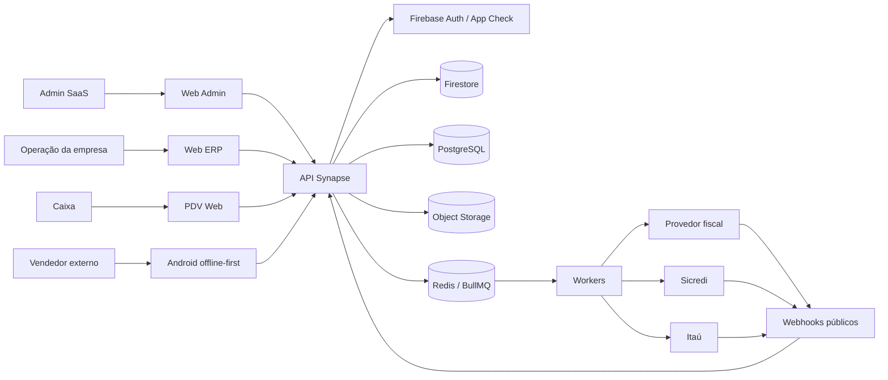
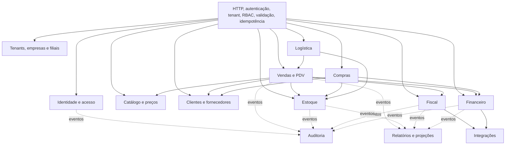
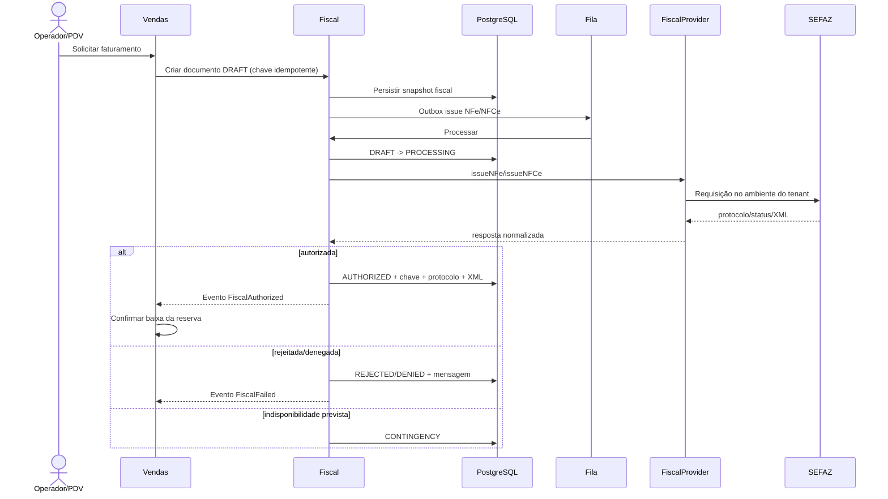
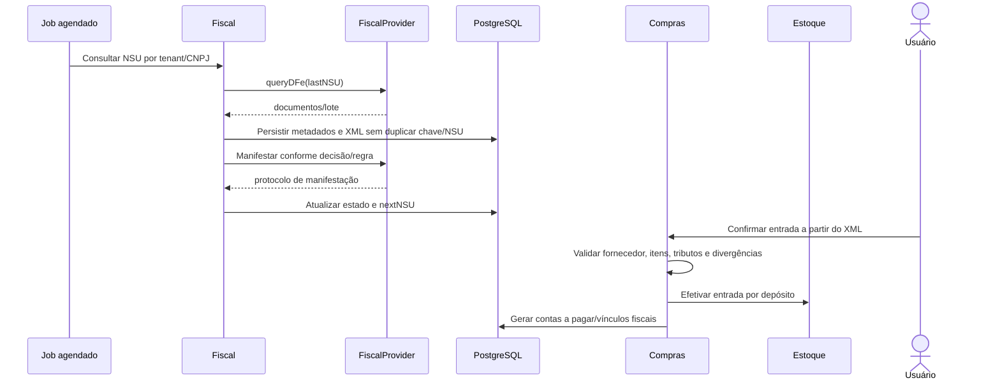
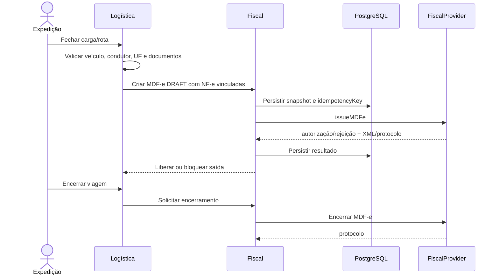
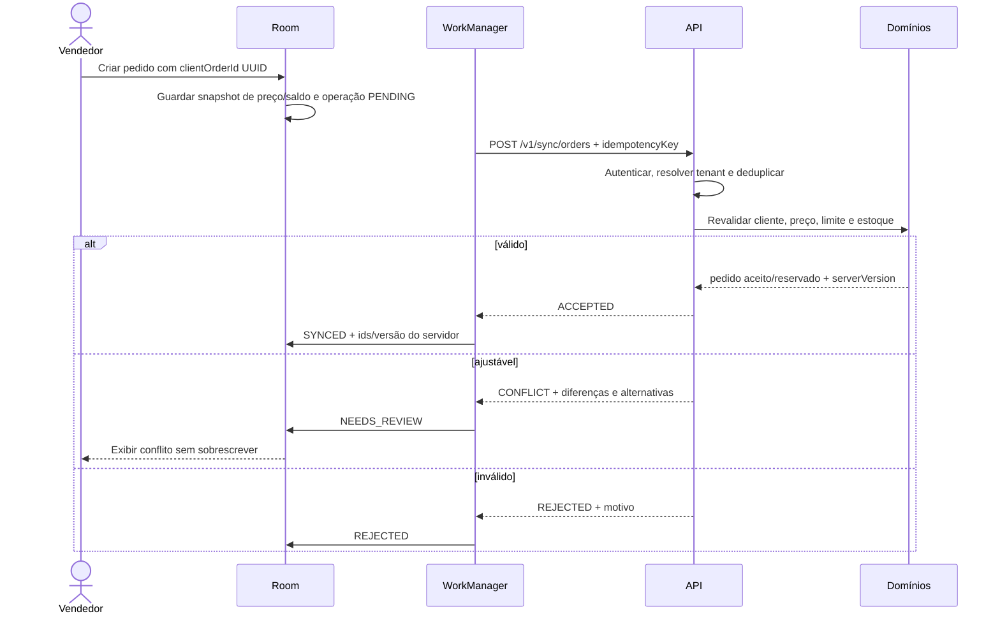

# Synapse — Proposta de arquitetura

Status: **Aprovada para implementação incremental**
Fase: 0  
Última atualização: 2026-09-05

## 1. Objetivo e escopo

Esta proposta define a base técnica do Synapse, um ERP SaaS multi-tenant para distribuidoras de ração, lojas pet e operações agropecuárias com matriz, filiais, depósitos, vendedores externos, PDV, fiscal e bancos.

O desenho considera 100 mil ou mais produtos, 500 mil ou mais clientes e milhões de vendas e movimentos. Esta fase contém apenas decisões e diagramas. A implementação depende da aprovação humana deste documento e dos ADRs.

## 2. Diretrizes

- O backend é a única fronteira confiável para autorização, tenant, preço, saldo, numeração fiscal e efeitos financeiros.
- Cada módulo é dono de suas regras e dados. Integração interna ocorre por contratos explícitos e eventos de domínio.
- Operações críticas são idempotentes e auditáveis.
- Não existe transação distribuída entre Firestore, PostgreSQL e provedores externos; consistência entre eles é eventual e coordenada por outbox, fila e saga.
- Listagens usam cursor; métricas de alto volume usam projeções e agregações materializadas.
- Segredos bancários, certificado A1 e credenciais de provedor ficam no backend, criptografados e separados por ambiente.

## 3. Contexto do sistema



## 4. Arquitetura lógica e módulos

O primeiro estágio é um monólito modular NestJS implantável como API e workers separados. A separação é por domínio, não por camada global. Interfaces de provider isolam serviços externos.



Regras de dependência:

- Identidade e configuração não dependem de módulos comerciais.
- Estoque não depende de vendas; vendas solicita reserva e baixa por porta pública do estoque.
- Fiscal e financeiro consomem fatos de venda, mas não acessam tabelas internas de vendas.
- Integrações contém adaptadores, nunca regra de negócio.
- Auditoria e projeções consomem eventos e não participam da decisão transacional.
- Importações entre módulos só atravessam contratos públicos. Ciclos são proibidos.

## 5. Topologia SaaS multi-tenant

```mermaid
flowchart TB
  subgraph Clients
    W[Web apps]
    M[Android]
  end

  W --> CDN[Firebase Hosting / CDN]
  CDN --> GW[API HTTPS]
  M --> GW

  subgraph Runtime[Ambiente isolado: development, staging ou production]
    GW --> SEC[JWT + App Check + TenantContext + RBAC]
    SEC --> API[API stateless]
    API --> Q[(Redis / BullMQ)]
    Q --> WK[Workers stateless]
    API --> FS[(Firestore: /tenants/{tenantId}/...)]
    API --> PG[(PostgreSQL com tenant_id + RLS)]
    API --> ST[(Storage por prefixo do tenant)]
    API --> OBS[Logs, métricas e tracing]
    WK --> FS
    WK --> PG
    WK --> ST
    WK --> OBS
  end

  WK --> EXT[SEFAZ, fiscal e bancos]
```

O `tenantId` é derivado da identidade autenticada e associação ativa, nunca aceito do corpo ou query como autoridade. `branchId` e `warehouseId` solicitados são conferidos contra o escopo RBAC. No PostgreSQL, todas as tabelas de tenant possuem `tenant_id`, chaves compostas quando necessário e Row-Level Security. No Firestore, dados ficam sob `tenants/{tenantId}` e as regras negam acesso cruzado; o backend repete a validação.

## 6. Persistência e consistência

| Responsabilidade                                                   | Fonte de verdade                                     | Motivo                                                               |
| ------------------------------------------------------------------ | ---------------------------------------------------- | -------------------------------------------------------------------- |
| Tenant, filiais, catálogo, clientes, preços operacionais e pedidos | Firestore                                            | leitura operacional, atualização em tempo real e sincronização móvel |
| Saldo corrente por produto/depósito                                | Firestore                                            | transação atômica no agregado de estoque exigido pelo domínio        |
| Movimentos operacionais de estoque                                 | Firestore append-only                                | gravados na mesma transação do saldo e da outbox                     |
| Fiscal, financeiro, conciliação e escrituração                     | PostgreSQL                                           | restrições, relacionamentos, consultas e reconciliação transacional  |
| Auditoria de segurança                                             | PostgreSQL append-only com cópia/exportação imutável | consulta relacional, retenção e cadeia de custódia                   |
| Dashboards e relatórios                                            | Projeções PostgreSQL/Redis                           | evita varrer coleções operacionais                                   |
| XML, DANFE, comprovantes, anexos e backups                         | Object Storage                                       | objetos grandes, versionamento e política de retenção                |

No Firestore, o saldo usa `tenants/{tenantId}/inventory/{branchId}_{warehouseId}_{productId}`. A mesma transação escreve saldo, movimento imutável e evento de outbox. Um worker publica/processa o evento com `eventId`; consumidores registram esse identificador para garantir efeito único. Falhas são repetidas com backoff e vão para dead-letter após o limite operacional.

## 7. Fluxo de estoque

```mermaid
sequenceDiagram
  actor U as Usuário/PDV
  participant S as Vendas
  participant I as Estoque
  participant F as Firestore transaction
  participant O as Outbox/Worker

  U->>S: Criar pedido (idempotencyKey)
  S->>I: Reservar itens
  I->>F: Ler saldo e validar disponível
  F->>F: physical/reserved/blocked + movimento RESERVE + outbox
  F-->>I: commit ou conflito
  I-->>S: reserva confirmada

  alt faturamento autorizado
    S->>I: Baixar reserva
    I->>F: reserved -= q; physical -= q; movimento SALE + outbox
  else cancelamento
    S->>I: Liberar reserva
    I->>F: reserved -= q; movimento RELEASE + outbox
  end
  F-->>O: evento pendente
  O-->>S: projeções e auditoria atualizadas
```

Invariantes: `available = physical - reserved - blocked`; quantidades não são negativas sem permissão e motivo explícitos; toda mutação cria movimento; reservar, baixar e liberar usam a versão atual do pedido e são idempotentes.

## 8. Fluxo NF-e e NFC-e



NFC-e segue o mesmo núcleo, com regras e contingência próprias do documento. Cancelamento e carta de correção são comandos independentes, idempotentes e auditados. Campos exatos do provedor só serão definidos após leitura da documentação contratada.

## 9. Fluxo DF-e e entrada por XML



Importar XML é uma proposta revisável até confirmação. Chave de acesso e NSU impedem duplicidade. A manifestação não ocorre implicitamente quando exigir decisão do usuário.

## 10. Fluxo MDF-e



Uma carga só é liberada após estado fiscal compatível. Inclusão de condutor, cancelamento e encerramento são operações separadas e auditadas.

## 11. Fluxos bancários

### Sicredi

```mermaid
sequenceDiagram
  participant F as Financeiro
  participant Q as Fila
  participant B as SicrediProvider
  participant S as Sicredi
  participant W as Webhook

  F->>Q: Criar boleto ou cobrança PIX (idempotencyKey)
  Q->>B: createBoleto/createPixCharge
  B->>S: API homologada
  S-->>B: identificador, linha/QR e status
  B-->>F: resposta normalizada
  S->>W: evento assinado
  W->>W: validar assinatura e deduplicar eventId
  W->>Q: enfileirar; responder 2xx
  Q->>F: liquidar/baixar uma única vez
```

### Itaú

```mermaid
sequenceDiagram
  participant F as Financeiro
  participant Q as Fila
  participant B as ItauProvider
  participant I as Itaú
  participant W as Webhook

  F->>Q: Criar boleto ou cobrança PIX (idempotencyKey)
  Q->>B: createBoleto/createPixCharge
  B->>I: API homologada
  I-->>B: identificador, linha/QR e status
  B-->>F: resposta normalizada
  I->>W: evento assinado
  W->>W: validar assinatura e deduplicar eventId
  W->>Q: enfileirar; responder 2xx
  Q->>F: liquidar/baixar uma única vez
```

Endpoints, autenticação, assinatura e campos permanecem pendentes da documentação/contrato oficial de cada banco. O domínio financeiro só enxerga o contrato `BankProvider` normalizado.

## 12. Estratégia offline do vendedor



O cliente usa fila durável, retry exponencial e o mesmo `clientOrderId` em todo reenvio. O servidor mantém a decisão associada à chave. Dados de referência usam cursor de sincronização e `version`; alterações locais permitidas usam conflito otimista. Estoque, preço final, limite, fiscal e financeiro nunca usam last-write-wins nem tratam o cache local como autoridade.

## 13. Segurança, disponibilidade e operação

- Firebase Auth autentica; a API valida JWT, revogação, App Check e associação do usuário.
- `TenantContext` e RBAC são aplicados antes do controller e novamente nos repositórios.
- Entrada é validada por schema; rate limit ocorre por IP, usuário e tenant.
- Webhooks validam assinatura sobre o corpo bruto antes de parsear efeitos e registram tentativas inválidas.
- Logs estruturados incluem `requestId`, `correlationId`, tenant, ator e operação, sem segredos ou dados pessoais desnecessários.
- API e workers são stateless e escalam separadamente. Jobs têm timeout, retry limitado e dead-letter.
- Ambientes development, staging e production possuem projetos, bancos, buckets, filas e secrets separados.
- Backups de Firestore, PostgreSQL e Storage têm retenção definida e restauração testada.

Metas iniciais a validar por teste de carga: p95 de leitura interativa abaixo de 500 ms; comandos síncronos abaixo de 1 s sem contar provedor externo; resposta de webhook abaixo de 2 s após persistir/enfileirar; zero efeitos duplicados nas rotas idempotentes. SLOs definitivos dependem de baseline da Fase 10.

## 14. Evolução e gates

1. Validar os limites dos módulos e a matriz de fontes de verdade.
2. Aprovar os ADRs abaixo.
3. Modelar entidades, consultas e índices no cartão específico de dados.
4. Só então iniciar monorepo e Fase 1.

A extração de um módulo para serviço independente só é considerada quando houver necessidade comprovada de escala, isolamento operacional, cadência de deploy ou equipe. Os primeiros candidatos naturais são workers fiscais, bancários e de relatórios; contratos e outbox já preservam essa possibilidade.

## 15. ADRs

- [ADR-0001 — Monólito modular e workers](adr/0001-monolito-modular.md)
- [ADR-0002 — Persistência poliglota](adr/0002-persistencia-poliglota.md)
- [ADR-0003 — Isolamento multi-tenant](adr/0003-isolamento-multitenant.md)
- [ADR-0004 — Versionamento de API](adr/0004-versionamento-api.md)
- [ADR-0005 — Eventos, outbox e idempotência](adr/0005-eventos-outbox-idempotencia.md)
- [ADR-0006 — Sincronização offline](adr/0006-sincronizacao-offline.md)
- [ADR-0007 — Providers fiscal e bancário](adr/0007-providers-externos.md)
- [ADR-0008 — Consistência do estoque](adr/0008-consistencia-estoque.md)

## 16. Pontos para aprovação humana

- Confirmar Firestore como fonte operacional de catálogo, pedidos e saldo, e PostgreSQL como fonte fiscal/financeira.
- Confirmar custo e operação de Cloud SQL e Redis desde o primeiro release.
- Definir retenção legal de XML, auditoria e dados pessoais com jurídico/contabilidade.
- Validar contingência e estados reais com o provedor fiscal.
- Validar autenticação, assinatura e homologação com Sicredi e Itaú.
- Aprovar metas de disponibilidade, latência, RPO e RTO.

Mudanças nesses pontos exigem revisão humana e atualização do ADR correspondente.
